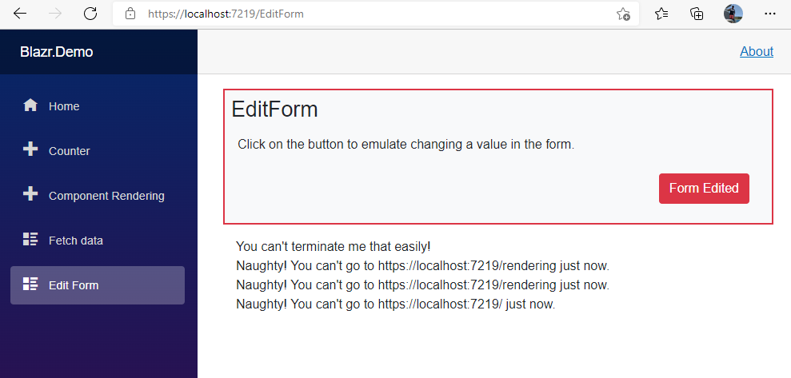

# Introduction

The solution works by replacing the existing `Router` with a very lightly modified version of the out-of-the-box `Router`.  The new `BlazrRouter` replaces the DI injected `NavigigationManager` service with an interface defined service.  `IBlazrNavigationManager` defines the same NavigationManager properties and methods as the original.  The Router code knows no difference, it's the same.

This allows us to define an intermediate Navigation Manager between the standard Blazor `NavigationManager` or `RemoteNavigationManager` and the Router.  We now have control over whether we pass navigation requests to the router or discard them.

The one drawback is that the code has no access to `HotReloadManager` (thanks Microsoft!) so hot reloading is disabled, unless someone can show me how to do it.

## Library

### BlazrRouter

The three changes to the standard router are:

1. Changing the type on the injected NavigationManager

```csharp
[Inject] public virtual IBlazrNavigationManager NavigationManager { get; set; }
```

2. Disabling the `HotReloadManager` in `Attach` and `Dispose`. `HotReloadManager` is `internal` to the original code base.


```csharp
public void Attach(RenderHandle renderHandle)
{
    _logger = LoggerFactory.CreateLogger<BlazrRouter>();
    _renderHandle = renderHandle;
    _baseUri = NavigationManager.BaseUri;
    _locationAbsolute = NavigationManager.Uri;
    NavigationManager.LocationChanged += OnLocationChanged;

    // <<<====================== THIS IS A CHANGE ========================>>>
    //if (HotReloadManager.Default.MetadataUpdateSupported)
    //{
    //    HotReloadManager.Default.OnDeltaApplied += ClearRouteCaches;
    //}
}
```

```csharp
public void Dispose()
{
    NavigationManager.LocationChanged -= OnLocationChanged;

    // <<<====================== THIS IS A CHANGE ========================>>>
    //if (HotReloadManager.Default.MetadataUpdateSupported)
    //{
    //    HotReloadManager.Default.OnDeltaApplied -= ClearRouteCaches;
    //}
}
```

### IBlazrNavigationManager

First the interface.  This just defines the functionality used by the router, so we can decouple `BlazrRouter` from the NavigationManager implementation.

```csharp
public interface IBlazrNavigationManager
{
    public string Uri { get; }
    public string BaseUri { get; }
    public event EventHandler<LocationChangedEventArgs> LocationChanged;
    public string ToBaseRelativePath(string uri);
    public void NavigateTo(string uri, bool forceLoad);
    public void NavigateTo(string uri, bool forceLoad = false, bool replace = false);
    public void NavigateTo(string uri, NavigationOptions options);
}
```

## CoreNavigationManager

This is a simple transparent pass through Navigation Manager.  There's no logic applied. Using this with `BlazrRouter` provides the same functionality as the standard router.  Note it inherits from `NavigationManager` and implements `IBlazrNavigationManager`.

```csharp
public class CoreNavigationManager : NavigationManager, IBlazrNavigationManager
{
    private NavigationManager _baseNavigationManager;

    public CoreNavigationManager(NavigationManager? baseNavigationManager)
    {
        _baseNavigationManager = baseNavigationManager!;
        base.Initialize(_baseNavigationManager!.BaseUri, _baseNavigationManager.Uri);
        _baseNavigationManager.LocationChanged += OnBaseLocationChanged;
    }

    protected override void EnsureInitialized()
        => base.Initialize(_baseNavigationManager.BaseUri, _baseNavigationManager.Uri);

    private void OnBaseLocationChanged(object? sender, LocationChangedEventArgs e)
    {
        this.Uri = e.Location;
        // Trigger the Location Changed event for all listeners
        this.NotifyLocationChanged(e.IsNavigationIntercepted);
    }
}
```

### BlazrNavigationManager

This is the real thing.

1. `_baseNavigationManager` is where we keep the Blazor standard `NavigationManager`
2. `_isBlindNavigation` is a bool used in the displayed Url reset process - more later.
3. `IsLocked` is our locking control property.  You can't set it directly.
4. There are three events whose purpose is self evident from their names and three Notify Methods for them.
5. The constructor gets the Blazor Navigation Manager though DI, makes sure this instance is initialized, and registers an event handler with the Blazor Navigation Manager `LocationChanged` event.
6. `Dispose` clears up the event registration.

```csharp
public class BlazrNavigationManager : NavigationManager, IBlazrNavigationManager, IDisposable
{
    private NavigationManager _baseNavigationManager;
    private bool _isBlindNavigation = false;
        
    public bool IsLocked { get; protected set; } = false;

    public event EventHandler<BlazrNavigationEventArgs>? NavigationEventBlocked;
    public event EventHandler<LockStateEventArgs>? LockStateChanged;
    public event EventHandler? BrowserExitAttempted;

    public BlazrNavigationManager(NavigationManager? navigationManager)
    {
        _baseNavigationManager = navigationManager!;
        base.Initialize(navigationManager!.BaseUri, navigationManager.Uri);
        _baseNavigationManager.LocationChanged += OnBaseLocationChanged;
    }

    // code to follow ...........

    protected void NotifyNavigationEventBlocked(object? sender, BlazrNavigationEventArgs e)
        => this.NavigationEventBlocked?.Invoke(sender, e);

    protected void NotifyLockStateChanged(object? sender, LockStateEventArgs e)
        => this.LockStateChanged?.Invoke(sender, e);

    public void NotifyBrowserExitAttempt(object? sender)
        => this.BrowserExitAttempted?.Invoke(sender, EventArgs.Empty);

    public void Dispose()
        => _baseNavigationManager.LocationChanged -= OnBaseLocationChanged;
```

Locking and Unlocking is controlled by `SetLockState`.  It sets `IsLocked` and raises the `LockStateChanged` event.  

```csharp
public void SetLockState(bool state)
{
    if (state != this.IsLocked)
    {
        this.IsLocked = state;
        this.NotifyLockStateChanged(this, new LockStateEventArgs(this.IsLocked));
    }
}
```

The event handler for `LocationChanged` does all the work.  The process is complicated by the fact that the browser displayed Url is the one we are navigating to.  If we cancel navigation, then we need to reset it back to the previous value.

We accomplish this by doing what I call a blind navigation.  

The locked process is to set `_isBlindNavigation` to true and call a `NavigateTo` on the base Navigator in the `LockedNavigation` method, creating a circular reference.  When `OnBaseLocationChanged` gets called the `BlindNavigation` method resets `_isBlindNavigation` and the event handler exits.  `LockedNavigation` raises the `NavigationEventBlocked` event.

If the lock is not set, we set the global `Uri` to the new Uri and trigger a `LocationChanged` event that triggers routing.


```csharp
private void OnBaseLocationChanged(object? sender, LocationChangedEventArgs e)
{
    // Check if we are blind navigating - i.e. just resetting the display Uri. - Do nothing
    if (this.BlindNavigation())
        return;

    // Check if Navigation is locked
    if (this.LockedNavigation(e.Location))
        return;

    // Normal Navigation path

    // NOTE: We set the Uri before calling notify location changed, as it will use this uri property in its args.
    this.Uri = e.Location;

    // Trigger the Location Changed event for all listeners including the Router
    this.NotifyLocationChanged(e.IsNavigationIntercepted);

    // Belt and braces to ensure false 
    _isBlindNavigation = false;
}

private bool BlindNavigation()
{
    if (_isBlindNavigation)
    {
        _isBlindNavigation = false;
        return true;
    }
    return false;
}

private bool LockedNavigation(string uri)
{
    // Sets the displayed uri back to the orginal if we're locked.
    if (this.IsLocked)
    {
        // prevents a NavigateTo loop
        _isBlindNavigation = true;
        _baseNavigationManager.NavigateTo(this.Uri, false);
        this.NotifyNavigationEventBlocked(this, new BlazrNavigationEventArgs(uri));
    }
    return this.IsLocked;
}
```

### PageLocker

`PageLocker` is a UI component that interacts with the browser.

It injects the `JsRuntime` and `IBlazrNavigationManager`.

1. It Registers a handler on the NavigationManager's `LockStateChanged` event.  This drives `SetPageExitCheck` which activates or de-activates the browser `beforeunload` event listener - JS code below.
2. When `beforeunload` is active `AgentExitAttempt` is wired up to any attempt to exit and drives the event into the NavigationManager to trigger the `BrowserExitAttempted` event.

```csharp
public class PageLocker : ComponentBase, IDisposable
{
    [Inject] private IJSRuntime? _js { get; set; }
    [Inject] private IBlazrNavigationManager? _navManager { get; set; }
    private BlazrNavigationManager? NavManager => (_navManager is BlazrNavigationManager) ? _navManager as BlazrNavigationManager : null;

    protected override void OnInitialized()
    {
        if (this.NavManager is not null)
            NavManager.LockStateChanged += OnLockStateChanged;
    }

    private void OnLockStateChanged(object? sender, LockStateEventArgs e)
        => this.SetPageExitCheck(e.State);

    private void SetPageExitCheck(bool state)
    {
        var objref = DotNetObjectReference.Create(this);
        _js!.InvokeAsync<bool>("blazr_setEditorExitCheck", objref , state);
    }

    [JSInvokable]
    public Task AgentExitAttempt()
    {
        NavManager?.NotifyBrowserExitAttempt(this);
        return Task.CompletedTask;
    }

    public void Dispose()
    {
        if (this.NavManager is not null)
            NavManager.LockStateChanged -= OnLockStateChanged;
    }
}
```

### JS Code

The JS code loaded into the SPA is as follows.  It registers or de-registers a method with the browser's `beforeunload` event.  It also provides a callback mechanism to notify the C# code that an attemnpt to exit has been made.

```js
window.blazr_setEditorExitCheck = function (dotNetHelper, show) {
    if (show) {
        window.addEventListener("beforeunload", blazr_showExitDialog);
        blazrDotNetExitHelper = dotNetHelper;
    }
    else {
        window.removeEventListener("beforeunload", blazr_showExitDialog);
        blazrDotNetExitHelper = null;
    }
}

var blazrDotNetExitHelper;

window.blazr_showExitDialog = function (event) {
    event.preventDefault();
    event.returnValue = "There are unsaved changes on this page.  Do you want to leave?";
    blazrDotNetExitHelper.invokeMethodAsync("AgentExitAttempt");
}
```

### NavigationManagerExtensions

This provides some convenient methods to add the Routing services to an application.

## Implementation

The implementation solutiuon is based on one of my templates.

## Blazr.Demo.Routing.UI

This contains the UI code.

### EditForm

`EditForm` is a demostrator with no data, jusdt a buttton to emulate dirty state.  Note the `PageLocker` component.

```razor
@page "/EditForm"
@namespace Blazr.NavigationManager.UI

<PageLocker />
<div class="p-2 border @this.DivCss border-2 bg-light">
    <h3>EditForm</h3>
    <div class="p-2">Click on the button to emulate changing a value in the form.</div>
    <div class="p-2 m-2 text-end">
        <button class="btn @this.BtnCss me-1" @onclick="this.SwitchDirtyState">@this.BtnText</button>
    </div>
</div>
<div class="p-2 m-2">
    @((MarkupString)this.message)
</div>
```
There's a lot of code to sort the UI, but the bsics are:

1. Get the `IBlazrNavigationManager` and convert it to `BlazrNavigationManager`.
2. Add event handlers so we can display some messages to demo the event functionality.
3. Change Edit state by calling `BlazrNavManager.SetLockState`.

```csharp
public partial class EditForm : ComponentBase, IDisposable
{
    private bool _dirty;
    private string message = string.Empty;
    [Inject] private IBlazrNavigationManager? _navigationManager { get; set; }
    private IBlazrNavigationManager NavigationManager => _navigationManager!;
    private BlazrNavigationManager? BlazrNavManager => _navigationManager BlazrNavigationManager ? NavigationManager as BlazrNavigationManager : null;
    private string BtnCss => _dirty ? "btn-danger" : "btn-success";
    private string DivCss => _dirty ? "border-danger" : "border-success";
    private string BtnText => _dirty ? "Form Edited" : "Form Clean";

    protected override void OnInitialized()
    {
        if (this.BlazrNavManager is not null)
        {
            this.BlazrNavManager.BrowserExitAttempted += BrowserExitAttempted;
            this.BlazrNavManager.NavigationEventBlocked += NavigationAttempted;
        }
    }

    private void BrowserExitAttempted(object? sender, EventArgs e)
    {
        this.message += "You can't terminate me that easily!<br />";
        this.InvokeAsync(this.StateHasChanged);
    }

    private void NavigationAttempted(object? sender, BlazrNavigationEventArgs e)
    {
        this.message += $"Naughty! You can't go to {e.Uri} just now.<br />";
        this.InvokeAsync(this.StateHasChanged);
    }

    private void SwitchDirtyState()
    {
        _dirty = !_dirty;
        this.message = string.Empty;
        if (BlazrNavManager is not null)
            BlazrNavManager.SetLockState(_dirty);
    }

    public void Dispose()
    {
        if (this.BlazrNavManager is not null)
        {
            this.BlazrNavManager.BrowserExitAttempted -= BrowserExitAttempted;
            this.BlazrNavManager.NavigationEventBlocked -= NavigationAttempted;
        }
    }
}
```


## Blazr.Demo.Routing.Server.Web

This is the Blazor Server Implementation.

Register the services in `Program`.

```csharp
// Add services to the container.
//...
services.AddBlazrNavigationManager();
//...
```

Add the JS to `_Layouts.cshtml`

```html
    <script src="_framework/blazor.server.js"></script>
    <script src="_content/Blazr.Routing/site.js"></script>
```
## Blazr.Demo.Routing.WASM

This is the Blazor WASM Implementation.

Register the services in `Program`.

```csharp
builder.RootComponents.Add<HeadOutlet>("head::after");
var services = builder.Services;
{
//...
    services.AddBlazrNavigationManager();
}
//...
```

Add the JS to `index.html`

```html
    <script src="_framework/blazor.webassembly.js"></script>
    <script src="_content/Blazr.Routing/site.js"></script>
```


That's it, it "should" work.  Here's a screen shot:



